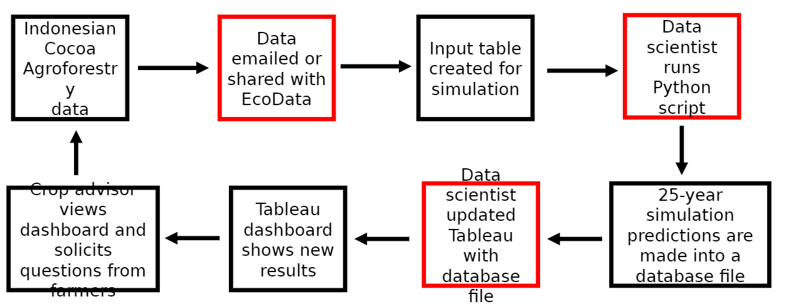

```{r setup, include=FALSE}
knitr::opts_chunk$set(echo = FALSE)
library(knitr)
library(kableExtra)
library(ggplot2)
library(tidyverse)
library(effects)
library(ecodatamisc)
demo_dat = read.csv("demo.csv")
dat2 = subset(demo_dat,State=="California")
dat3 = subset(demo_dat,State=="Florida")

bg = "#1b2724"
wh = "#ffffff"
pl = "#6eb39c"
```

<style>
p.caption {
  font-size: 0.8em;
  padding: 0px 0px 40px 0px;
}
.button {
  appearance: none;
  background-color: transparent;
  border: 3px solid #6eb39c;
  border-radius: 15px;
  box-sizing: border-box;
  color: #6eb39c;
  cursor: pointer;
  display: inline-block;
  font-family: Roobert,-apple-system,BlinkMacSystemFont,"Segoe UI",Helvetica,Arial,sans-serif,"Apple Color Emoji","Segoe UI Emoji","Segoe UI Symbol";
  font-size: 16px;
  font-weight: 600;
  line-height: normal;
  margin: 0;
  min-height: 60px;
  min-width: 0;
  outline: none;
  padding: 16px 24px;
  text-align: center;
  text-decoration: none;
  transition: all 300ms cubic-bezier(.23, 1, 0.32, 1);
  user-select: none;
  -webkit-user-select: none;
  touch-action: manipulation;
  width: 33%;
  will-change: transform;
}

.button:disabled {
  pointer-events: none;
}

.button:hover {
  color: #ffffff;
  border: 3px solid #ffffff;
  background-color: transparent;
  box-shadow: rgba(0, 0, 0, 0.25) 0 8px 15px;
  transform: translateY(-2px);
}
.button:active {
  box-shadow: none;
  transform: translateY(0);
}
</style>

## The problem: product failure

Agrochemical products deal with all the environmental extremes that occurs in the field. High temperatures, cold winds, and record droughts prevent products from working as intended. 

> *"We suspected extraordinarily high and low temperatures might impact the performance of our agrochemical used by citrus growers, causing expensive wastage for our customers."*


The client sales team had collected simple survey responses from growers, recording if their product had worked or not. These end-users were reporting more product failure in spring around days with extremely high maximum temperatures. **What was perplexing is it wasn’t happening on all farms.**


**So what was really occurring in the field?** And if temperature was the culprit, exactly when did chemical performance degrade? Our client's survey confirmed their suspicions, but they needed hard numbers to improve their product.

```{r, fig.cap="Sample of the initial end-user survey provided to us by the client (with GPS coordinates omitted)."}
#kable(demo_dat[1:5, 1:])
#kable(mtcars[1:5, ], format="latex") %>%
#  kable_styling(latex_options="scale_down")
demo_dat[1:5, ] %>%
  kbl() %>%
  kable_minimal()
```

## Our solution: enriching end-user surveys

> *"Surprisingly, that was all the data we had to provide to Ecodata so they could start answering our questions."*

The rest of the information we used was generated in-house by our environmental data scientists. Daily temperatures, rainfall, even cumulative degree days - all of these were leveraged to enrich the client's existing surveys.



## Digging deeper

We then used this information to pinpoint temperature thresholds where product failed, so our client knew when exactly their growers could spray to minimize waste.

But how clear-cut these temperature thresholds were depended on state. **We dug deeper to answer why.**
