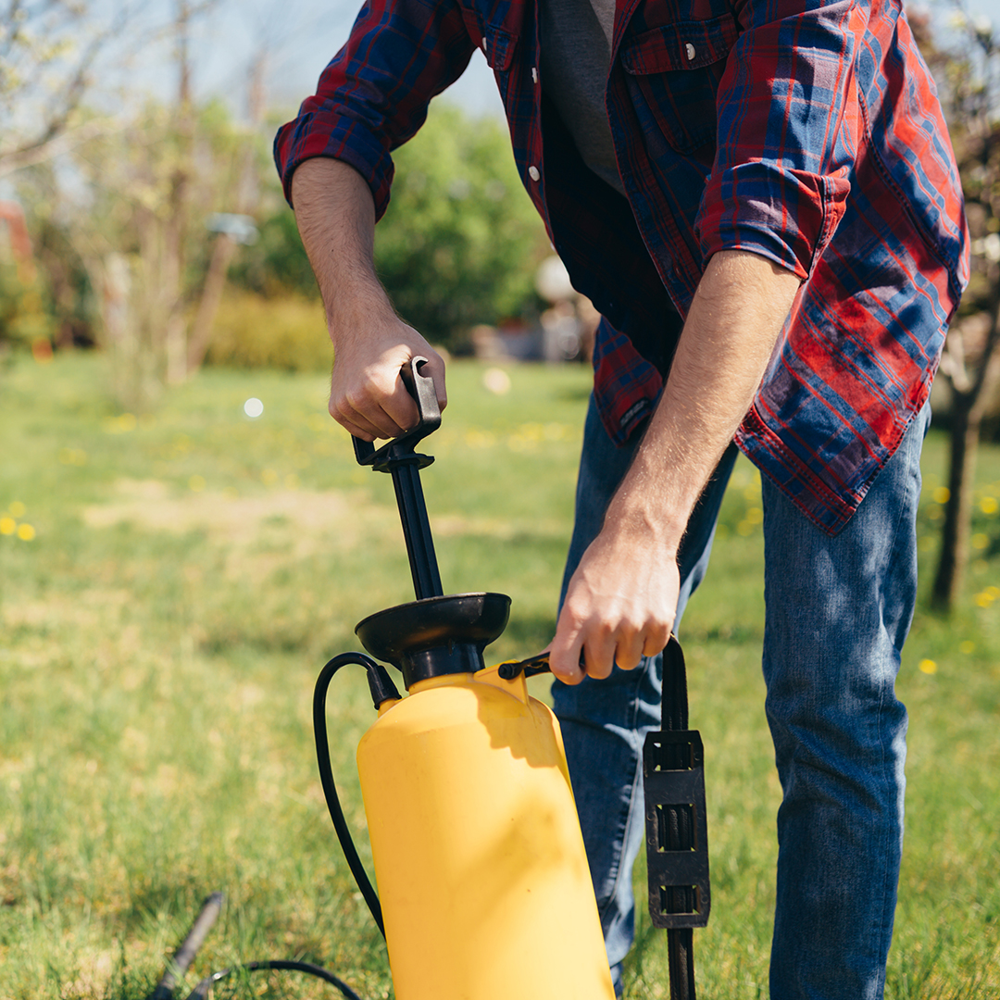

## The problem: product failure

Agrochemical products deal with all the environmental extremes that occurs in the field. High temperatures, cold winds, and record droughts prevent products from working as intended. Our client suspected high temperatures were inhibiting an herbicide, causing expensive wastage, but this wasn’t happening on all farm which was perplexing.

[image of some scorched plants]

The client sales team had collected simple survey responses from growers, recording if their product had worked or not. These end-users were reporting more product failure in spring around days with extremely high maximum temperatures.

[salesperson surveying a farmer]

But was this really occurring in the field? And if so, at what temperatures? Our client's survey confirmed their suspicions, but they needed hard numbers to improve their product.
[flow chart of data being emailed or shipped]

## Our solution: enriching end-user surveys

Surprisingly, that was all the data we needed from our client to start answering their question. The rest of the information we used was generated in-house by our environmental data scientists. Daily temperatures, rainfall, even cumulative degree days - all of these were leveraged to enrich the client's existing surveys.

`\begin{table}
\centering
\resizebox{\linewidth}{!}{
\begin{tabular}{l|r|r|r|r|r|r|r|r|r|r|r}
\hline
  & mpg & cyl & disp & hp & drat & wt & qsec & vs & am & gear & carb\\
\hline
Mazda RX4 & 21.0 & 6 & 160 & 110 & 3.90 & 2.620 & 16.46 & 0 & 1 & 4 & 4\\
\hline
Mazda RX4 Wag & 21.0 & 6 & 160 & 110 & 3.90 & 2.875 & 17.02 & 0 & 1 & 4 & 4\\
\hline
Datsun 710 & 22.8 & 4 & 108 & 93 & 3.85 & 2.320 & 18.61 & 1 & 1 & 4 & 1\\
\hline
Hornet 4 Drive & 21.4 & 6 & 258 & 110 & 3.08 & 3.215 & 19.44 & 1 & 0 & 3 & 1\\
\hline
Hornet Sportabout & 18.7 & 8 & 360 & 175 & 3.15 & 3.440 & 17.02 & 0 & 0 & 3 & 2\\
\hline
\end{tabular}}
\end{table}`

## Digging deeper

We then used this information to pinpoint temperature thresholds where product failed, so our client knew when exactly their growers could spray to minimize waste. But how clear-cut these temperature thresholds were depended on state. We dug deeper to answer why.

(Links to other pages)

