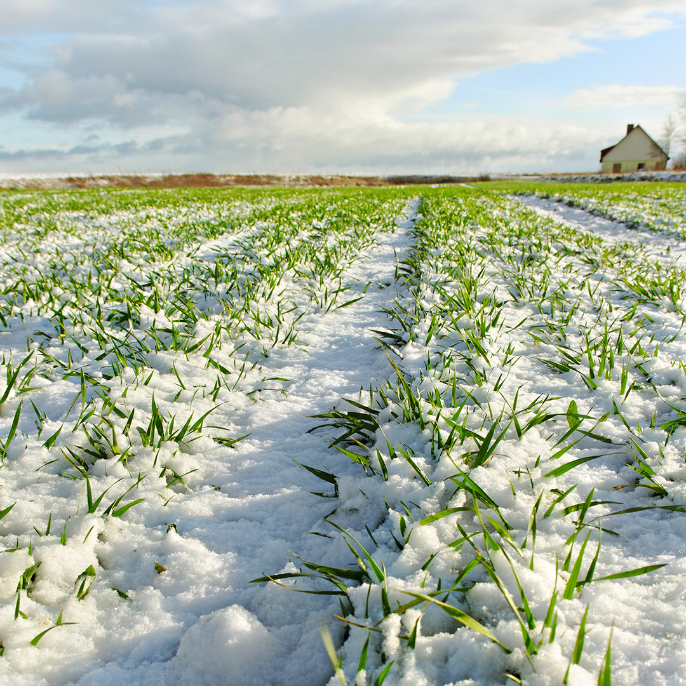
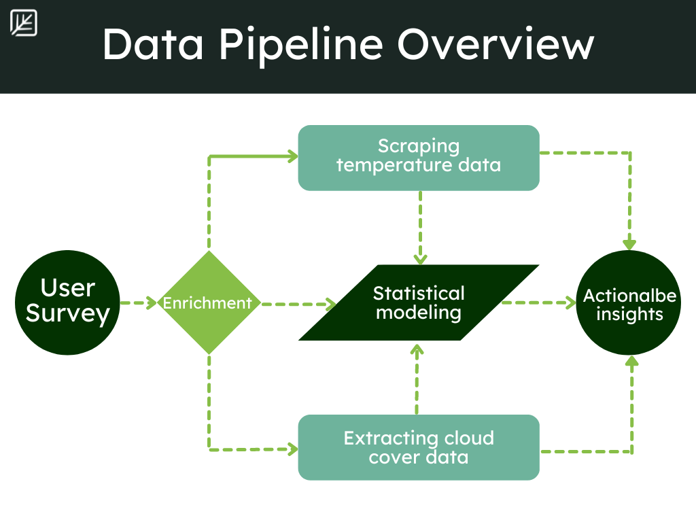

<link href="index_files/lightable/lightable.css" rel="stylesheet" />

## The problem: product failure

Agrochemical products deal with all the environmental extremes that occurs in the field. High temperatures, cold winds, and record droughts prevent products from working as intended. 

> *"We suspected extraordinarily high and low temperatures might impact the performance of our agrochemical used by citrus growers, causing expensive wastage for our customers."*

The client sales team had collected simple survey responses from growers, recording if their product had worked or not. These end-users were reporting more product failure in spring around days with extremely high maximum temperatures. **What was perplexing is it wasn’t happening on all farms.**

**So what was really occurring in the field?** And if temperature was the culprit, exactly when did chemical performance degrade? Our client's survey confirmed their suspicions, but they needed hard numbers to improve their product.

<table class=" lightable-minimal" style='font-family: "Trebuchet MS", verdana, sans-serif; margin-left: auto; margin-right: auto;'>
 <thead>
  <tr>
   <th style="text-align:left;"> State </th>
   <th style="text-align:left;"> Product_success </th>
   <th style="text-align:right;"> Daily_high_temp_Farenheit </th>
  </tr>
 </thead>
<tbody>
  <tr>
   <td style="text-align:left;"> Florida </td>
   <td style="text-align:left;"> Yes </td>
   <td style="text-align:right;"> 95 </td>
  </tr>
  <tr>
   <td style="text-align:left;"> California </td>
   <td style="text-align:left;"> Yes </td>
   <td style="text-align:right;"> 97 </td>
  </tr>
  <tr>
   <td style="text-align:left;"> California </td>
   <td style="text-align:left;"> Yes </td>
   <td style="text-align:right;"> 84 </td>
  </tr>
  <tr>
   <td style="text-align:left;"> California </td>
   <td style="text-align:left;"> No </td>
   <td style="text-align:right;"> 106 </td>
  </tr>
  <tr>
   <td style="text-align:left;"> California </td>
   <td style="text-align:left;"> Yes </td>
   <td style="text-align:right;"> 77 </td>
  </tr>
</tbody>
</table>

## Our solution: enriching end-user surveys

> *"Surprisingly, that was all the data we had to provide to Ecodata so they could start answering our questions."*

The rest of the information we used was generated in-house by our environmental data scientists. Daily temperatures, rainfall, even cumulative degree days - all of these were leveraged to enrich the client's existing surveys.

## Digging deeper

We then used this information to pinpoint temperature thresholds where product failed, so our client knew when exactly their growers could spray to minimize waste.

But how clear-cut these temperature thresholds were depended on state. **We dug deeper to answer why.**
