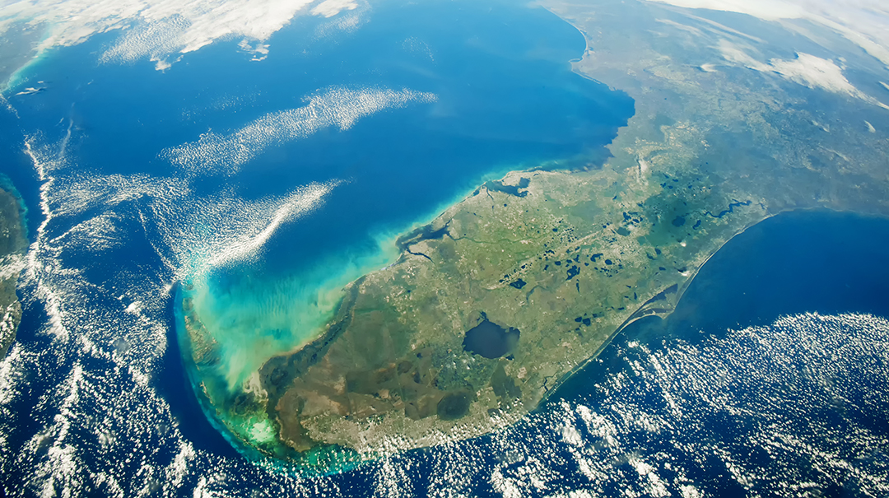

<style>
p.caption {
  font-size: 0.8em;
  padding: 0px 0px 40px 0px;
}
</style>

## Why cloud cover mattered

A key difference between growing in the moist East Coast and West Coast is cloud cover. Dense cloud cover blocks UV rays, but also starves fast-growing crop plants of light for photosynthesis. Both factors can affect agrochemical products.


Leveraging location information and end-user surveys provided by the client, we took care of the rest with our data mining expertise.

## What makes cloud cover tricky to measure?

Cloudiness is easy to define but hard to measure with remote sensing. LandSat 8 is a satellite photography program that hosts images taken of the Earths surface. We can’t just download the photos – these are millions of high-resolution images.

To explore how cloud cover impacted product outcomes in Florida, we needed to estimate cloud cover on farms for the entire week prior to product application.



## How we extracted cloud cover data

First we had to limit measurements to each farm. Using GIS tools, we mapped the locations of farms and drew 5km circles around the properties. We then downloaded imagery for the week leading up to product application. With automation we scaled this process efficiently to gather data for every grower’s farm. Here's a sample of how we did it:


```r
# function to fetch cloud cover data
get_cc <- function(buffer) {
  
  recs <- get_records(
                 time_range = as.character(c(buffer$app_date - 7, buffer$app_date)), 
                 products = get_cloudcov_supported()[5:6], # Sentinel
                 aoi = buffer$geometry, 
                 as_sf = FALSE)
  clouds <- calc_cloudcov(recs, aoi = buffer$geometry, 
                          write_records = FALSE, write_cloud_masks = FALSE, 
                          dir_out = "data/cloud-cover/")
  
  clouds %>%
    write_csv(file = paste0("data/cover-dfs-new/", buffer$id, "_cloud_cover.csv"))
}
```

We then calculated which proportion of the photograph was covered with thick clouds (% cover) using R. We took the average values for the week prior and viola – user surveys were enriched with weekly % cloud cover, specific to each and every farm that used our client’s herbicide.

<table>
 <thead>
  <tr>
   <th style="text-align:left;">   </th>
   <th style="text-align:left;"> State </th>
   <th style="text-align:left;"> Product_success </th>
   <th style="text-align:right;"> Daily_high_temp </th>
   <th style="text-align:right;"> Cloud_cover </th>
   <th style="text-align:left;"> response </th>
  </tr>
 </thead>
<tbody>
  <tr>
   <td style="text-align:left;"> 61 </td>
   <td style="text-align:left;"> Florida </td>
   <td style="text-align:left;"> No </td>
   <td style="text-align:right;"> 67 </td>
   <td style="text-align:right;"> 86 </td>
   <td style="text-align:left;"> No </td>
  </tr>
  <tr>
   <td style="text-align:left;"> 62 </td>
   <td style="text-align:left;"> Florida </td>
   <td style="text-align:left;"> No </td>
   <td style="text-align:right;"> 73 </td>
   <td style="text-align:right;"> 74 </td>
   <td style="text-align:left;"> No </td>
  </tr>
  <tr>
   <td style="text-align:left;"> 63 </td>
   <td style="text-align:left;"> Florida </td>
   <td style="text-align:left;"> No </td>
   <td style="text-align:right;"> 75 </td>
   <td style="text-align:right;"> 46 </td>
   <td style="text-align:left;"> No </td>
  </tr>
  <tr>
   <td style="text-align:left;"> 64 </td>
   <td style="text-align:left;"> Florida </td>
   <td style="text-align:left;"> No </td>
   <td style="text-align:right;"> 85 </td>
   <td style="text-align:right;"> 36 </td>
   <td style="text-align:left;"> No </td>
  </tr>
  <tr>
   <td style="text-align:left;"> 65 </td>
   <td style="text-align:left;"> Florida </td>
   <td style="text-align:left;"> No </td>
   <td style="text-align:right;"> 86 </td>
   <td style="text-align:right;"> 22 </td>
   <td style="text-align:left;"> No </td>
  </tr>
</tbody>
</table>

## Overall result from the cloud-cover analysis

As with high temperatures in Florida, product failure was slightly less likely on farms that have experienced a week of high cloud cover (Figure 2). Generally, the rate of failure is stable across all ranges of cloud cover (25% chance of product failure occurring).

<div class="figure">
}}index_files/figure-html/cloud-1.png" alt="Like temperature, cloud cover alone wasn't great at predicting product failure." width="672" />
<p class="caption">Figure 1: Like temperature, cloud cover alone wasn't great at predicting product failure.</p>
</div>

However, when accounting for temperature and cloud cover at the same time, we found that hot, clear days were much more likely to cause product failure than hot but cloudy days (Figure 3). When cloud cover is below 15%, hot days above 86F were much more likely to result in product failure, similar to the results found in California.

<div class="figure">
}}index_files/figure-html/interaction-1.png" alt="But the interplay of cloudiness and temperature was key. The solid line shows the effect of temperature on the product on clear sunny days, the dotted line on overcast days. The impact of temperature is strong on clear days, but not cloudy days." width="672" />
<p class="caption">Figure 2: But the interplay of cloudiness and temperature was key. The solid line shows the effect of temperature on the product on clear sunny days, the dotted line on overcast days. The impact of temperature is strong on clear days, but not cloudy days.</p>
</div>

## How we improved the end-user experience
Cloud cover turned out to be key. While temperature explained product failure in drier California, we uncovered a more nuanced interplay of temperature and cloud cover in wetter Florida. With these insights our client could advise growers with different agricultural systems how to get the most out of their product.


For end-users on the moist East coast, the best recommendation was to avoid using products on days with warm AND clear nights/mornings. That is, resembling a dry, hot Californian climate. But on overcast days, while not guaranteed, they may be able to get away with applying pesticide anyway.
