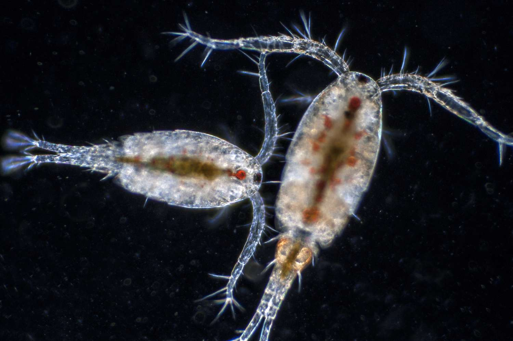
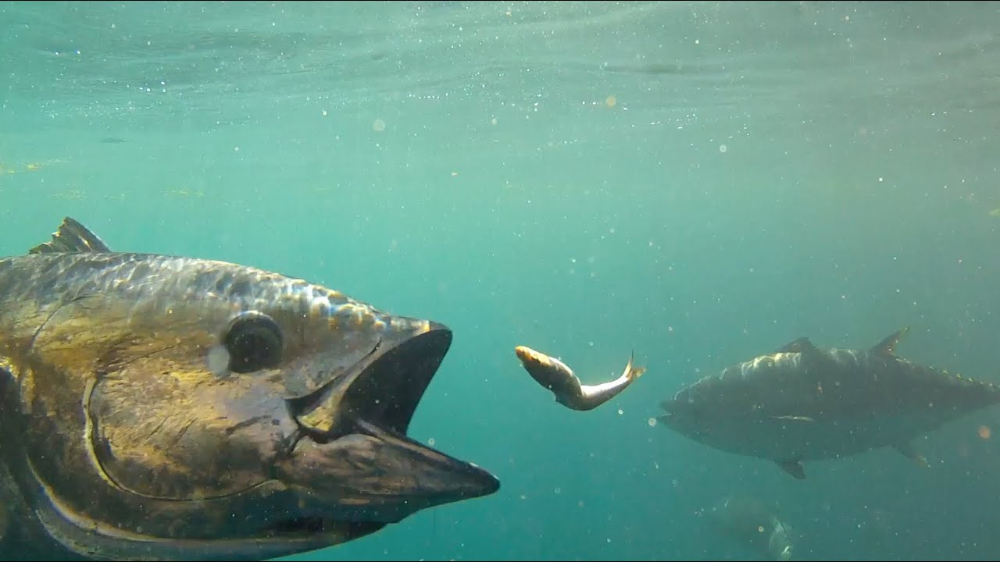
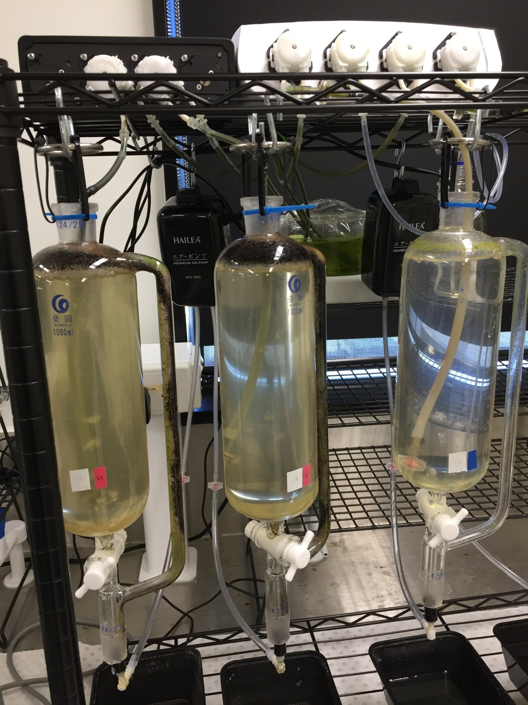

```{r setup, include=FALSE}
knitr::opts_chunk$set(echo = FALSE)
```
<body style="background-color:#1b2724;">
<span style="color:#fff;">

### **Client:** Monash University & University of Oxford
### **Themes:** Marine food webs, climate change, fisheries
### **When:** 2018-2022
### **How:** R, laboratory experiments

```{r img1, echo=FALSE, out.width= "34%", out.extra='style="float:left; padding:10px"'}

```

## Who cares - what are copepods anyway?

Copepods are not well known among the general public, but they play a vital role in the healthy functioning of our oceans. Copepods comprise most of the marine zooplankton, over 75% by biomass. They are an important source of food, providing the link between phytoplankton – which capture energy from the sun – and the wider marine foodwebs that need this energy to thrive. They also play a critical role in the carbon cycle, transferring large quantities of carbon into the deep ocean through their waste.

## Challenge

```{r img2, echo=FALSE, out.width= "34%", out.extra='style="float:left; padding:10px"'}

```

Given the importance of copepods we want to know how impacts of climate change, such as shifts in temperature and pH, might affect them – which may have knock-on effects for their predators and carbon cycling. Climate change will also have an indirect effect on food availability for copepods by impacting the algae they graze on, but we’re still learning how animals evolve at different levels of food abundance. One way to investigate evolutionary responses to food is to evolve copepods in a laboratory under controlled conditions.


## Solution

```{r img3, echo=FALSE, out.width= "34%", out.extra='style="float:left; padding:10px"'}

```

We reared 20 populations of copepods for about 30 generations under high or low food levels over 1.5 years, then measured a variety of morphological and life cycle (life history) traits to see how they diverged. We found evidence that food level drove systemic change in life histories, including in adult size and growth patterns and offspring investment strategies.


## Impact

We showed that well-established climate change-induced impacts on phytoplankton will alter copepod life histories, and these changes in zooplankton may have unforeseen knock-on effects for marine foodwebs and the global carbon pump.
</span>